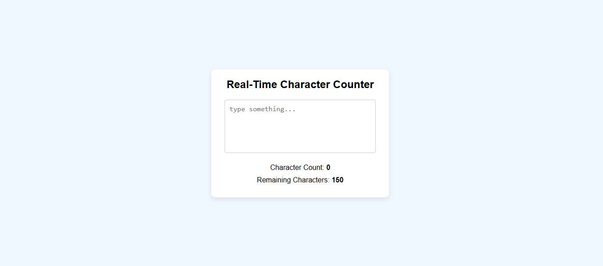

# ✍️ Real-Time Character Counter

This is a small JavaScript project that counts the characters as you type in a textarea. It also shows the remaining characters allowed (up to a max limit of 150) and prevents typing beyond the limit.

## 🚀 Live Demo
[Click here to view](https://eng-dhegacadde.github.io/Real-Time-Charector-Counter)

## 🧰 Technologies Used

- HTML
- CSS
- JavaScript

## 📸 Screenshot

## 💡 Features

- Live character counting
- Shows remaining characters
- Prevents input beyond 150 characters
- Color alert when you're near or at the limit
- Responsive and clean design

## 📁 Folder Structure

